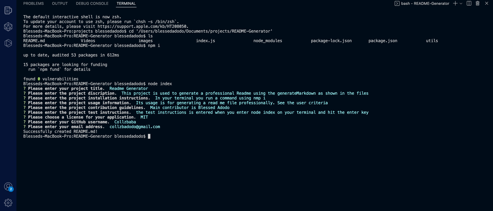

# Readme Generator
  ### License
  
  A short and simple permissive license with conditions only requiring preservation of copyright and license notices. Licensed works, modifications, and larger works may be distributed under different terms and without source code.
  https://choosealicense.com/licenses/mit/
  ***
  
  ## Description
  This project is used to generate a professional Readme using the generateMarkdown as shown in the files
  ***
  
  ## Table of Contents
  1. [Installation](#installation)
  2. [Usage](#usage)
  3. [Contribution](#contribution)
  4. [Test](#test)
  5. [Questions](#questions)
  ***
  
  
  ## Installation Instructions
  
  The user should clone the repository from GitHub and download Node.js. This application also requires to npm install node_modules and package-lock.json
  ***
  
  
  ## Usage Information
  
  Use inquirer from your command line to answer questions about your project
  ***
  
  
  ## Contribution
  Blessed Adodo
  ***

  
  ## Test
  you run the following command "node index" and then follow the instructions accordingly
  ***
  
  
  ## Questions
  
  ### GitHub Profile:
  https://github.com/Collzbaba
  
  ### Contact Me:
  If you have any additional questions, please send me an email.
  #### collzbadodo@gmail.com 

  ## Screenshots
  

  ## Video link
  #### https://kapwi.ng/w/WT3a9uaKVa

  